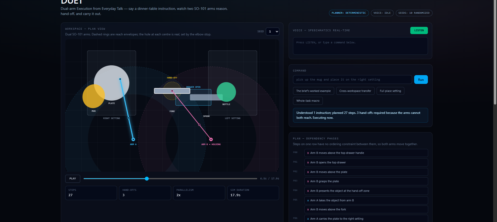
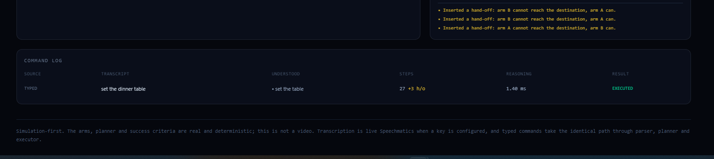
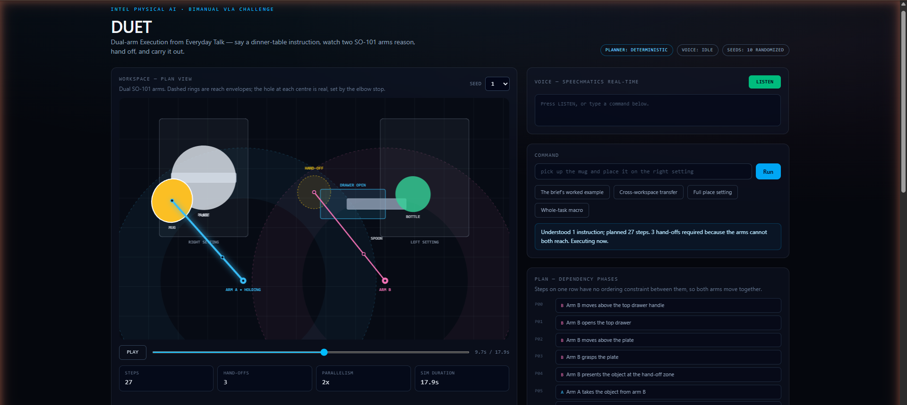
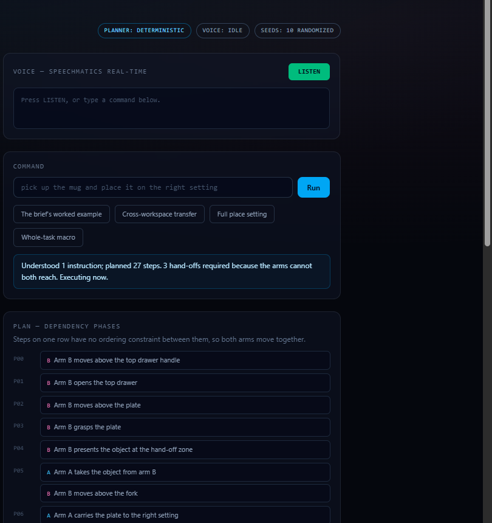

# DUET — Dual-arm Execution from Everyday Talk

**Say a dinner-table instruction. Two simulated SO-101 arms work out how to do it, hand objects between themselves when neither arm can reach alone, and carry it out.**

Built for the **AI Infra Summit Hackathon 2026** — Intel's online *Bimanual VLA Manipulation with Multi-Modal Reasoning* challenge, with **Speechmatics** real-time transcription as the operator interface.

### ▶ [Live demo — duet-alpha-ebon.vercel.app](https://duet-alpha-ebon.vercel.app) &nbsp;·&nbsp; 🎬 [Watch the demo (2:31)](https://youtu.be/zi3mNkrSNaw)

No install, no sign-up, no microphone required. Press a preset and watch two arms plan and execute.



```bash
git clone https://github.com/kmt9967/duet && cd duet
npm install
npm run dev        # http://localhost:3000
npm run verify     # typecheck + lint + 29 tests + benchmark
npm run test:voice # live Speechmatics end-to-end (needs a key)
```

---

## The problem

> *"Open the top drawer, pick up the plate with arm A, place it on the table, pick up the mug with arm B, pour water into the mug with arm A."*

That sentence — the worked example from Intel's challenge brief — is hard for three reasons that have nothing to do with speech recognition:

1. **It has preconditions.** The cutlery is inside a closed drawer. Nothing can be picked from it until the drawer is opened, and it should only be opened once no matter how many later instructions depend on it.
2. **It needs two arms that cannot each reach everywhere.** Each place setting sits inside exactly one arm's reach envelope. Moving an object across the table is physically impossible for a single arm, so the system has to notice that and transfer the object mid-plan.
3. **It has to survive the world not being where you left it.** Object positions, masses, frictions, and shapes all change between runs.

DUET addresses all three, and reports honestly on how often it succeeds.

## What it does

<!-- screenshots/01-command-center.png -->

- **Speech in.** Speechmatics real-time transcription streams from the browser microphone. Partial transcripts drive the live caption; only settled transcripts are executed, so a half-heard phrase never reaches the robot.
- **Understanding.** A deterministic parser turns the transcript into structured intents, tolerating everything real ASR produces — no punctuation, filler words, homophones (`"arm be"` → arm B), and multi-clause run-ons.
- **Planning.** Intents become a *dependency graph* of primitive arm actions, with preconditions chained, arms assigned by real inverse kinematics, and hand-offs inserted automatically where required.
- **Execution.** The graph runs with genuine concurrency: steps on different arms at the same graph depth execute simultaneously. Grasps can fail — a heavy, low-friction object may slip, and that propagates honestly.
- **Evaluation.** The same pipeline runs headless across 10 randomized seeds and reports a measured success rate.

## Results

Measured on the development machine (Intel Core i5-3470, 4 cores, 8 GB, Node v24.15.0). Reproduce with `npm run bench`.

| Task | Utterance | Success | Mean reasoning | Hand-offs |
|---|---|---|---|---|
| Full place setting | *"open the top drawer, pick up the plate with arm A, place it on the right setting, then put the fork on the right setting"* | **10/10** | 2.23 ms | 4 |
| Cross-workspace transfer | *"pick up the mug and place it on the right setting"* | **10/10** | 0.47 ms | 6 |
| The brief's worked example | *"open the top drawer, pick up the plate with arm A, place it on the table, pick up the mug with arm B, pour water into the mug with arm A"* | **9/10** | 0.68 ms | 5 |
| Whole-task macro | *"set the dinner table"* | **10/10** | 0.74 ms | 13 |

**Overall: 39/40 seed-task combinations (98%).**

The one failure is real and left in deliberately: on seed 6 the mug ends up at a position where neither arm can achieve the pouring pose within its elbow limit. The system reports exactly that rather than silently skipping the step. See [docs/BENCHMARKS.md](docs/BENCHMARKS.md).

A "success" requires all three of: the command fully planned with no errors, every step executed without failure, **and** the world actually ending in the requested state. Scoring on goal predicates alone would let a plan that dropped half the command pass whenever the scene happened to start near the goal.

## How it works

```
 microphone ──► Speechmatics RT ──► transcript
                                       │
                                       ▼
                            parser  (deterministic)
                                       │  intents
                                       ▼
                            planner (deterministic)
                                       │  dependency graph
                                       ▼
                            executor (IK + grasp model)
                                       │
                          ┌────────────┴────────────┐
                          ▼                         ▼
                  animated plan view        benchmark harness
```

Full detail in [docs/ARCHITECTURE.md](docs/ARCHITECTURE.md).

### Three design decisions worth calling out

**The planner is deterministic, and no language model sits in the action path.** A model can *explain* a plan, but it never chooses one. The same utterance against the same seed produces a byte-identical plan every time — which is what makes the benchmark meaningful and the behaviour auditable. This is a property the test suite enforces.

**Reachability is decided by solving IK, never by a radius test.** The scene generator, the planner, and the executor all call the same solver. This matters more than it sounds: the usable workspace is an *annulus*, not a disc, because a target too close to the base needs more elbow flexion than the servo allows. A radius heuristic would place objects in that central hole and generate plans the executor then refuses.

**Hand-offs are a consequence, not a scripted set-piece.** Each placemat is verified at scene-generation time to sit inside exactly one arm's envelope. When the arm holding an object cannot reach the destination and the other can, the planner inserts a give/take pair through a shared zone. Nothing in the code special-cases "the demo".

## Voice

Real Speechmatics real-time transcription over WebSocket, **verified live**: 5/5 synthesised utterances transcribed and 5/5 turned into executable plans. Reproduce with `npm run test:voice`; raw output is committed at [`evidence/speechmatics/live-test.json`](evidence/speechmatics/live-test.json).

| Spoken | Returned | Result |
|---|---|---|
| "Set the dinner table." | *Set the dinner table.* | 27 steps, 3 hand-offs |
| "Pick up the mug and place it on the right setting." | *Pick up the mug and place it on the right setting.* | 4 steps |
| "Stop." | *Stop.* | control intent — correctly **not** planned |

One run is more informative than the clean ones: Speechmatics returned *"pick up the plate with arm."*, losing the "A". The parser emitted `pick` without an arm binding and the planner assigned one itself by reachability. The command still executed. That is the designed degradation, not a lucky escape.

The API key stays server-side — the browser receives only a 120-second JWT from `/api/speechmatics-token`, with a 60-per-hour quota guard so a reconnect loop cannot drain free-tier credits. **The microphone is requested before a token is minted**, so a refused permission prompt costs nothing.

Every failure degrades to typed input rather than breaking: missing key, denied microphone, quota hit, or dropped socket each surface as a message and leave the app fully usable. **Typed commands take the identical path** through parser, planner and executor — the fallback is not a different system.

Detail, including two defects the live test exposed: [docs/SPEECHMATICS-INTEGRATION.md](docs/SPEECHMATICS-INTEGRATION.md).

To enable voice locally:

```bash
cp .env.example .env.local
# add SPEECHMATICS_API_KEY, then restart the dev server
```

## Demo commands

Say these, or type them — identical code path either way.

```
set the dinner table
pick up the mug and place it on the right setting
open the top drawer, pick up the plate with arm A, place it on the table
place the fork on the right setting
hand the plate to arm B
pour water into the mug
stop
reset
```

The parser is built for ASR output, so it also copes with no punctuation, fillers, and homophones — `"um okay so pick up the cup with arm be"` resolves to a pick on the mug with arm B.

## Scope

DUET focuses on **multi-modal reasoning, voice interaction, bimanual task planning, deterministic safety, and reproducible simulation** within the constraints of remote-only hardware. Those are the parts of the challenge it addresses well, and the numbers backing them are all measured.

The scope it does **not** cover is stated just as plainly, because the rubric rewards reproducibility and a judge should not have to guess:

- **No OpenVINO, no Intel Core Ultra results.** The rubric allocates 20/100 points to optimized inference on Core Ultra Series 2/3. The development machine is a 2012 Core i5-3470 with no NPU, so there is nothing to report and nothing is claimed. No benchmark in this repo was produced on Intel Core Ultra hardware.
- **Not MuJoCo.** The brief names MuJoCo as the primary simulator. This is a purpose-built deterministic simulator with analytic SO-101 kinematics, a Coulomb-friction grasp model, and seeded domain randomization. It runs in any browser with zero install — which is a real advantage for a judge, but it is not the named simulator and is not a physics engine. Contact dynamics, collision response between objects, and arm-arm collision are not modelled.
- **No learned policy.** The brief invites fine-tuning a VLA policy (SmolVLA, Pi0.5, ACT) via LeRobot. Nothing here is learned; the reasoning is symbolic and deterministic. That is a deliberate trade given the hardware and time available, and the architecture is honest about it rather than dressing up rules as a policy.
- **Perception is not from pixels.** The planner reads scene state directly. There is no camera-to-state estimation step, so the "multi-modal" half of the challenge is addressed on the language side only.
- **Link lengths are approximations** of published SO-101 geometry, not a calibrated URDF.

What *is* real: the kinematics, the joint limits, the reach annulus, the hand-off logic, the grasp-failure model, the domain randomization, the concurrency, the success criterion, and every number in the results table.

## Verification

```bash
npm run verify
```

- `npm run typecheck` — clean
- `npm run lint` — clean
- `npm test` — 29 tests, all passing ([evidence](evidence/tests/test-output.txt))
- `npm run bench` — 98% across 10 seeds ([evidence](evidence/benchmarks/benchmark.json))

Tests cover ASR-shaped parser input, IK round-tripping (`FK(IK(p)) == p`), plan acyclicity, the invariant that an arm never runs two steps at once, hand-off give/take pairing, precondition chaining, determinism, and failure propagation.

## Tech

TypeScript · Next.js 16 · React 19 · Tailwind CSS 4 · Canvas 2D · Speechmatics real-time SDK · Node test runner · Vercel

No Python, no Docker, no build-time model download. `npm install && npm run dev` is the whole setup.

## Screenshots

All captured from production. More in [`evidence/final-ui/`](evidence/final-ui/).

| | |
|---|---|
| **One sentence, one command** — the command log after `set the dinner table`: 27 steps, +3 hand-offs, EXECUTED  | |
| **Hand-off in progress** — both arms converging on the shared zone  | |
| **Dependency phases** — steps on one row run concurrently  | |

## Links

| | |
|---|---|
| Live demo | <https://duet-alpha-ebon.vercel.app> |
| Demo video | <https://youtu.be/zi3mNkrSNaw> |
| Repository | <https://github.com/kmt9967/duet> |
| Slide deck | [`submission/DUET-AI-Infra-Summit.pdf`](submission/DUET-AI-Infra-Summit.pdf) |
| Track | Intel — Bimanual VLA Manipulation with Multi-Modal Reasoning (online) |
| Bonus | Best Use of Speechmatics |

## Repository map

| Path | Contents |
|---|---|
| `src/lib/core/` | RNG, world types, SO-101 kinematics, seeded scene generation |
| `src/lib/language/` | Intent vocabulary and the ASR-tolerant parser |
| `src/lib/planner/` | Dependency-graph plan representation and the planner |
| `src/lib/sim/` | Executor (grasp model, failure propagation) and playback sampler |
| `src/lib/eval/` | Task specs, goal predicates, benchmark harness |
| `src/lib/voice/` | Speechmatics real-time hook |
| `src/app/`, `src/components/` | Console UI and workspace renderer |
| `tests/` | 29 tests |
| `docs/` | Architecture, integration notes, benchmarks, rules audit |
| `evidence/` | Captured benchmark and test output |

## Licence

MIT.
